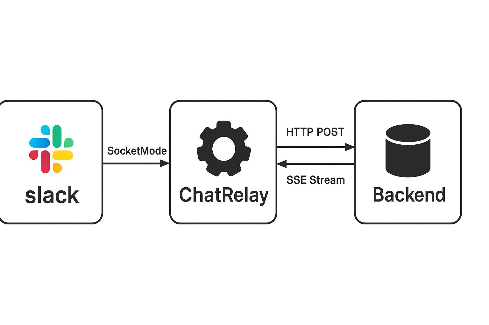

# ChatRelay

ChatRelay is a concurrent, observable, Slack-integrated bot built in Go. It listens for `@mentions` in Slack and streams responses from a mock backend. The project showcases key practices in Go such as concurrency, error handling, and observability using OpenTelemetry.

---

## 🛠️ Project Overview

ChatRelay connects Slack to a backend system via HTTP and streams responses back into Slack channels. It uses:

- **Socket Mode** for real-time Slack event processing.
- **OpenTelemetry** for distributed tracing.
- **Goroutines** and channels for non-blocking IO.
- A **mock backend** that simulates streaming replies word-by-word.




---

## ⚙️ Setup and Running Instructions

### 1. Slack App Configuration

Go to [api.slack.com/apps](https://api.slack.com/apps) and create a new app.

#### 🔐 Bot Scopes (OAuth & Permissions)

- `app_mentions:read`
- `chat:write`
- `channels:history`
- `groups:history`
- `im:history`

#### 📡 Event Subscriptions

Enable event subscriptions and add the following event:

- `app_mention`

#### 🧩 Socket Mode

Enable **Socket Mode** and generate an **App-Level Token** with:

- Scope: `connections:write`

#### 🔑 OAuth Tokens

- **Bot User OAuth Token**: `xoxb-...`
- **App-Level Token**: `xapp-...`

---

## ✅ Slack Setup Troubleshooting

If you face any issue with Slack event handling, try the following steps:

1. Go to your Slack App Dashboard:  
   [https://api.slack.com/apps](https://api.slack.com/apps)

2. Select your app (**ChatRelay**).

3. Navigate to **Event Subscriptions** in the left menu.

4. Turn **ON** the toggle for **"Enable Events"**.

5. Under **Subscribe to bot events**, add the following (if not already present):
   - `app_mention` – to handle when your bot is mentioned.
   - *(Optionally)* `message.im` – to handle DMs to the bot.

6. **Save Changes**.

7. **Reinstall/Update** the app in your workspace if prompted.

---

### 2. Environment Variables

Create a `.env` file or set system environment variables:

```env
SLACK_APP_TOKEN=xapp-1-...
SLACK_BOT_TOKEN=xoxb-...
BACKEND_URL=http://localhost:8091/v1/chat/stream
MOCK_BACKEND_PORT=8091

```

---

### 3. Running the Bot

**Step 1:** Clone and install dependencies

```bash
git clone https://github.com/yourusername/chatrelay-go.git
cd chatrelay-go
go mod tidy
```

**Step 2:** Run the mock backend server

```bash
go run cmd/mockbackend/main.go
```

**Step 3:** Run the bot

```bash
go run cmd/bot/main.go
```

---

### 4. Interacting with the Bot

Invite the bot to a channel, then mention it like so:

```
@chatrelay Hello!
```

The bot will respond word-by-word with a simulated backend reply.

